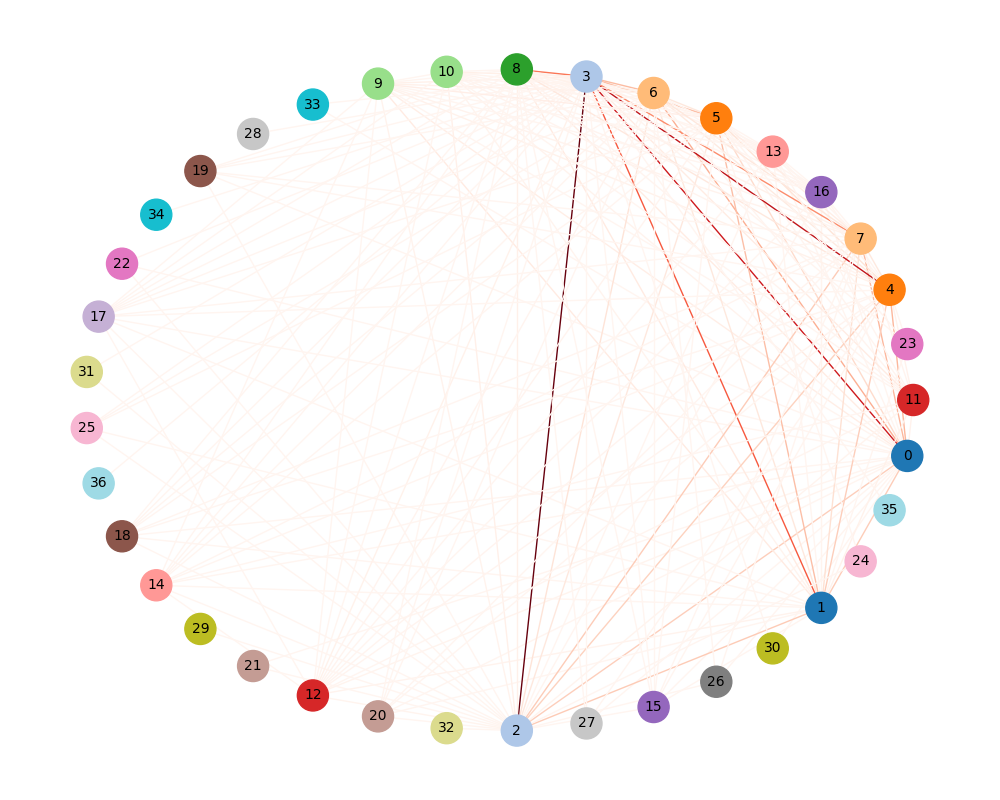
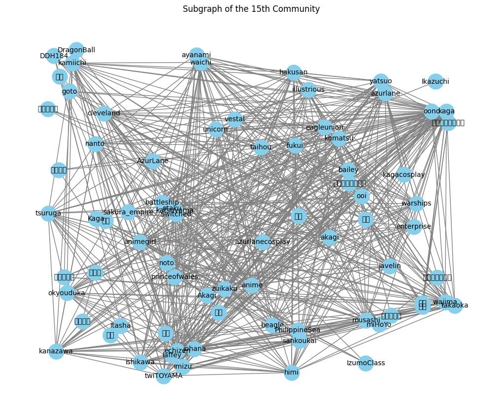
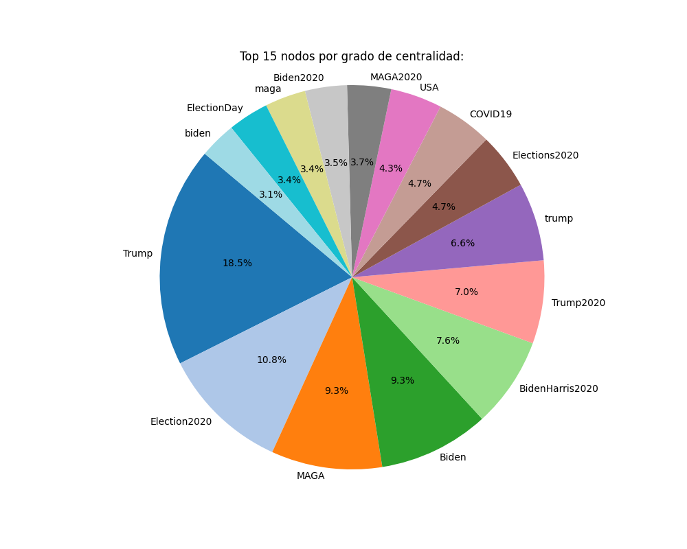

# 🌎 SNA-project-MAADM-UPM
SNA practice with a graph containing Twitter (X) hashtags connections. Subject of UPM ML and BD master´s degree.

# 📂 Folder "images"
Images of the different notebook exercise plots. Some examples are:

    

    

    

    

# 📓 Notebook "SNA-práctica-2024-25.ipynb"
Notebook that presents different meso-analytic exercises in the community graph. Accompanied with some visual plots. 

# 📓 Notebook "Tournament.ipynb"
Notebook were a GNN was presented to a GNN tournament done in class, with the corresponding final results in the .png image. The best test accuracy of each model is the one inside the parenthesis. Our model was called "Soft_Gonzalo".

# ⚖️ License
This code is usable and free always under the license. Free to play.

# 👥 Authors
* Alejandro Mendoza [@pintamonas4575](https://github.com/pintamonas4575)
* Jaime Álvarez     [@JaimeAlvarez434](https://github.com/JaimeAlvarez434)